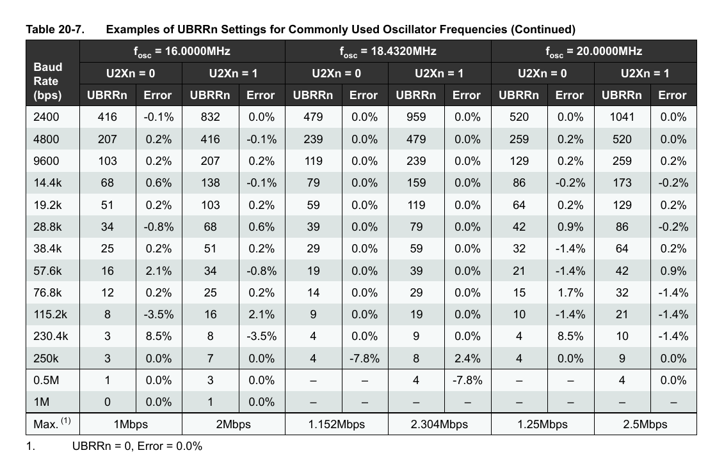
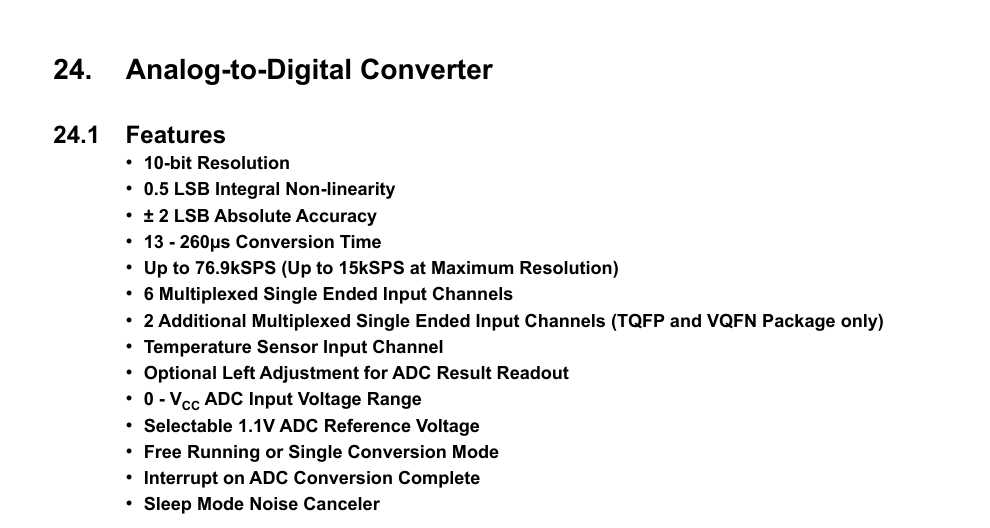
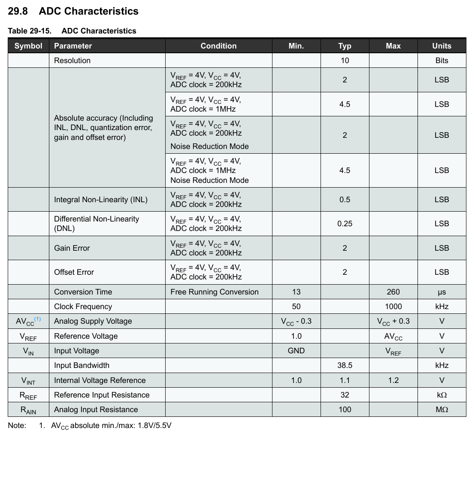

# AVR-ADC (Atmega328p)

Используем микроконтроллер AVR Atmega328p для отправки значений с АЦП на компьютер по UART.

Файл UART_Binary_Reader.jar является программой для записи передаваемых по UART бинарных данных в формате 8N1.

Предполагается частота тактирования микроконтроллера в 16 МГц (Частота плат Arduino). Частота UART в  1 Mbps.

Таким образом, бит U2X0 в регистре UCSR0A должен быть выставлен в единицу, а значение UBRR0 будет равняться единице. Смотри в таблице ниже.

Согласно документации максимальная тактовая частота АЦП составляет 200 кГц (200000/13=15384 SPS) для максимального разрешения в 10 бит. Однако, можно увеличить скорость работы АЦП за счет уменьшения точности его работы. Если тактовая частота АЦП составляет 1 МГц, то количество выборок в секунду можно оценить как 1000000/13 = 76923. В таком режиме работы не имеет смысла читать последние два бита результата АЦП. В таком случае, надо использовать обратный порядок байтов, в котором записывается результат АЦП, поскольку как только ADCL считывается, доступ АЦП к регистрам данных блокируется. Когда ADCH считывается, доступ АЦП к регистрам ADCH и ADCL повторно включается. При использовании обратного порядка байтов будет достаточно прочитать регистр ADCH. Характеристики АЦП приведены ниже.

